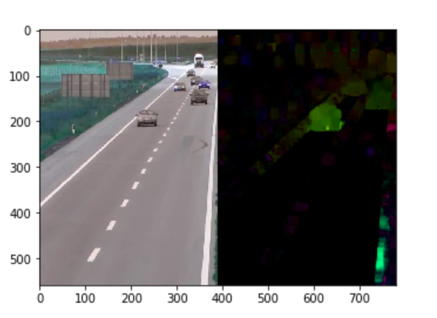

# Optical Flow Estimation Using OpenCV

This project is been used as a stepping stone to my Dynamic texture video projects. We are using this code to estimate optical flow and use it later for Dynamic Texture Identification - Originally developed 04/05/2018

## In this project it was developed 
A system for reading multiple videos and translate them into optical flow information. The videos were collected from a Dynamic Texture dataSet which is vital for later DynamiTexture based projects.

In this project, it was used the open-source library OpenCV for the collection of Optical Flow from regular RGB video

## Results of the Project 

## Technology Used 
1. OpenCV
2. Dynamic Texture DataSet
3. Python
4. JupyterNotebook
